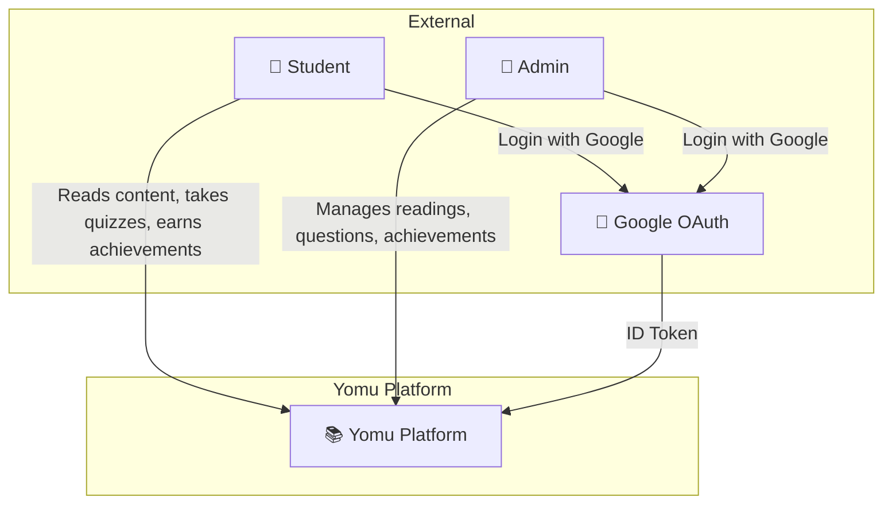
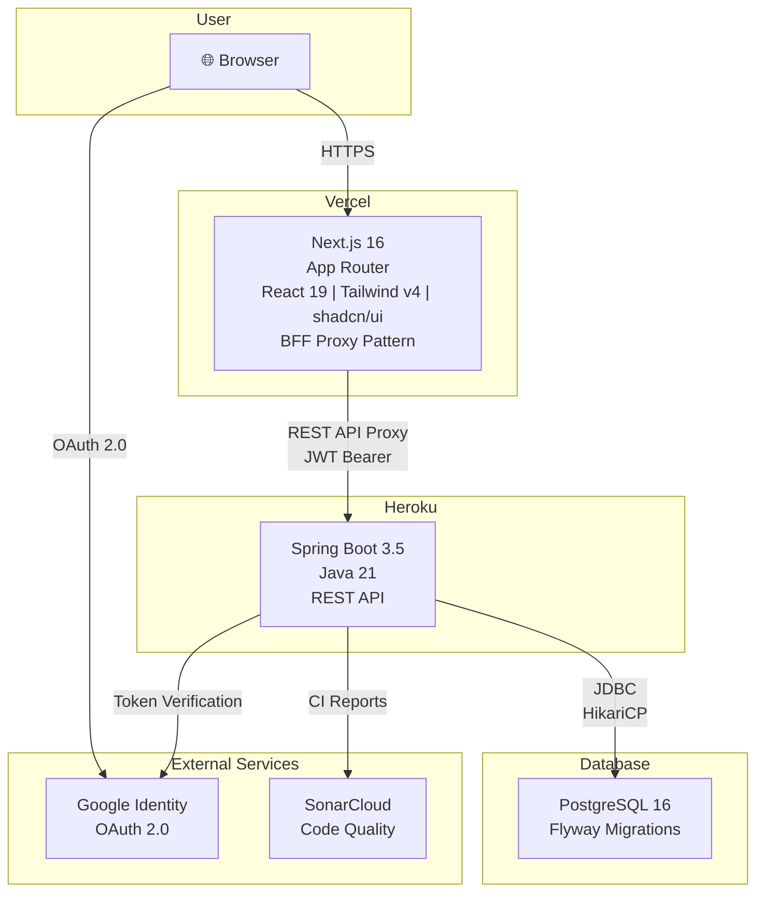
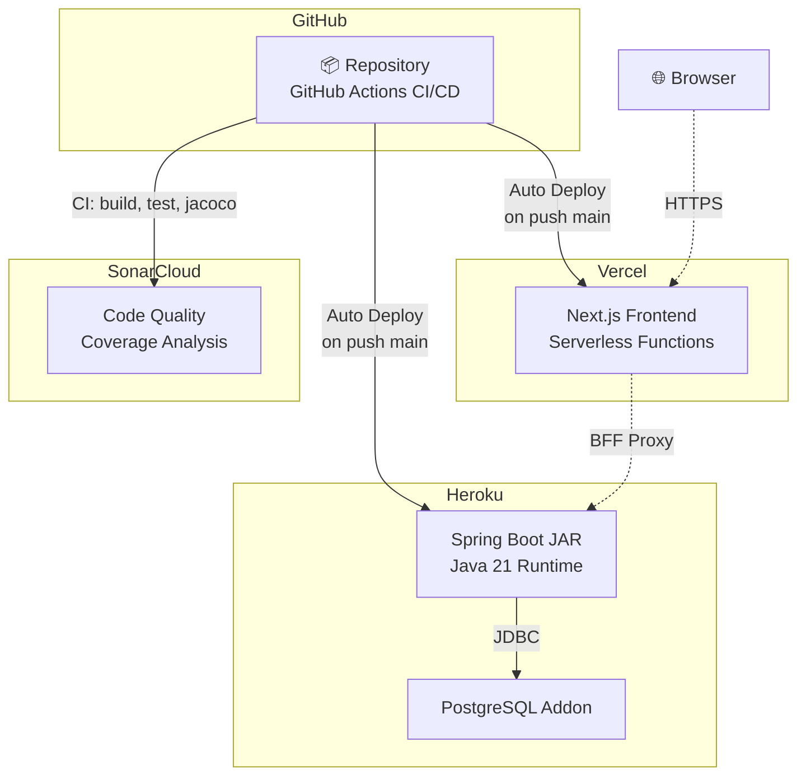
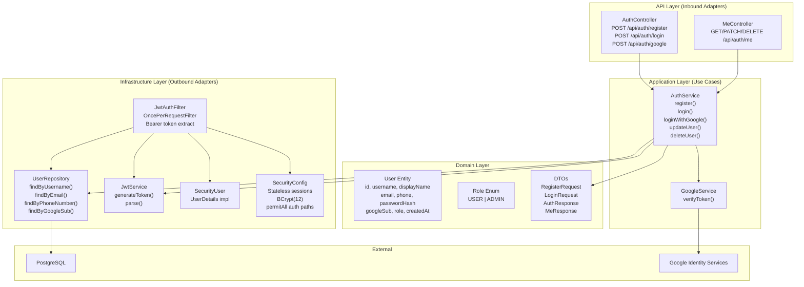
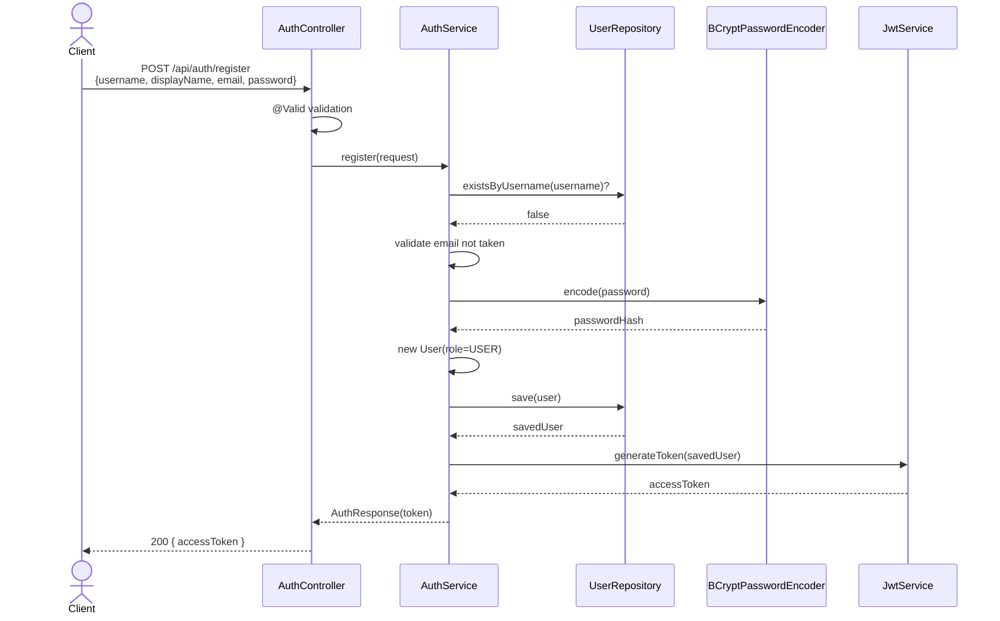
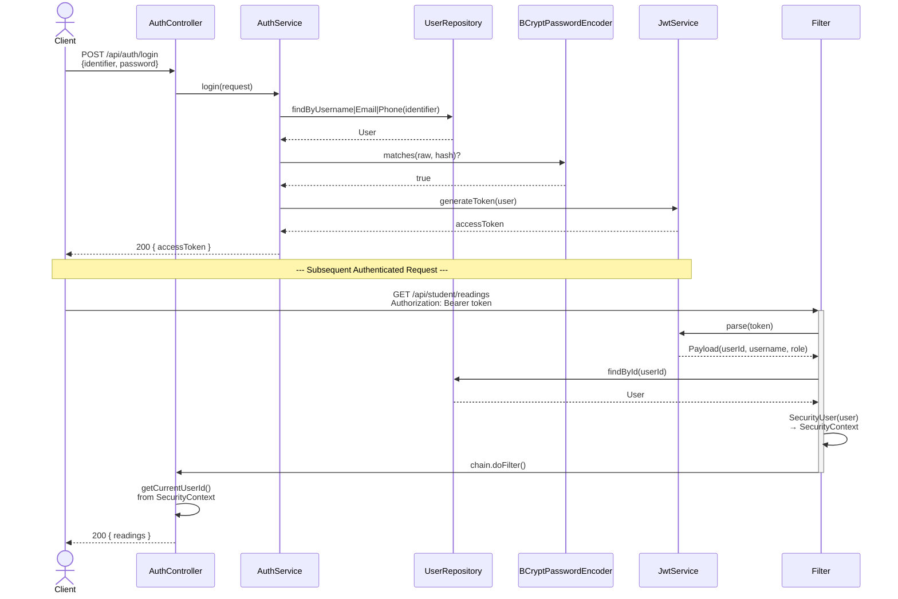
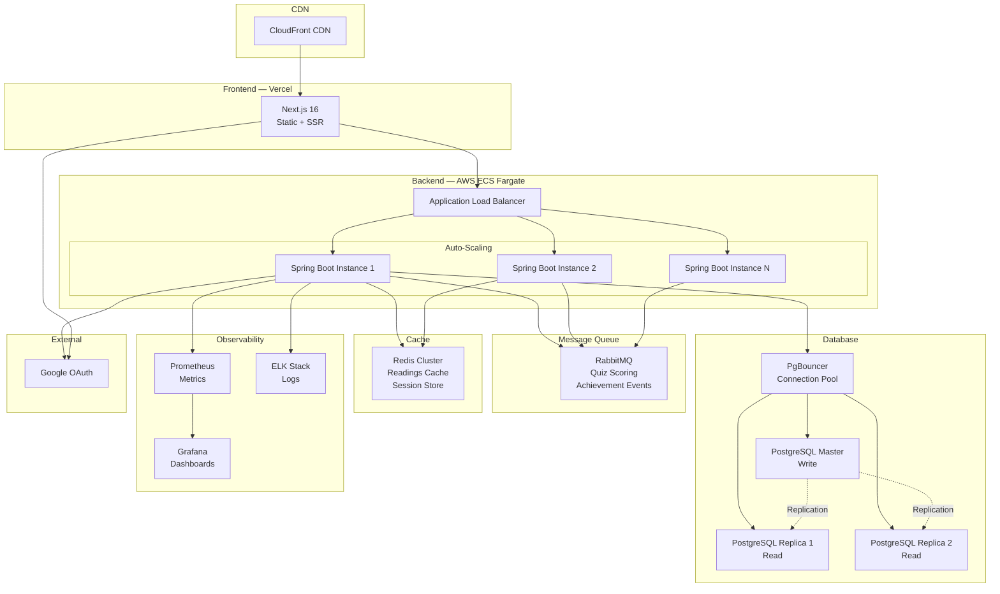

# YOMU — Online Reading & Quiz Platform

## Current Architecture

### 1. Context Diagram

### 2. Container Diagram

### 3. Deployment Diagram

### 4. Component Diagram — Auth Module (Hexagonal)

### 5. Code Diagram — Registration Flow

### 6. Code Diagram — Login & JWT Filter

## Risk Storming

> **Scenario:** Yomu hits 100K+ daily active users. What breaks?

| Risk | Severity | Impact | Mitigation |
|---|---|---|---|
| **JWT in localStorage** — XSS can steal tokens | 🔴 High | Account takeover at scale | Migrate to httpOnly cookie + CSRF |
| **Single PostgreSQL** — no read replica | 🔴 High | DB becomes bottleneck, SPOF | Read replicas, PgBouncer pooling |
| **Heroku single dyno** — no scaling | 🔴 High | Crash under traffic spike | Containerize → AWS ECS/K8s |
| **No caching layer** — every request hits DB | 🟡 Medium | Latency spike under load | Redis cache for readings/achievements |
| **Quiz scoring sync** — blocks request thread | 🟡 Medium | Timeouts, poor UX | Async queue (RabbitMQ) for scoring |
| **No CDN** — static assets from origin | 🟡 Medium | Slow global load times | CloudFront CDN |
| **No monitoring** — flying blind | 🟡 Medium | Can't detect outages | Prometheus + Grafana + ELK |
| **Forum/Social modules stubs** | 🟢 Low | Missing features | Complete development |

## Future Architecture (Scaled)

| Layer | Current | Future |
|---|---|---|
| **Frontend** | Vercel | Vercel + CloudFront CDN |
| **Backend** | Heroku single dyno | AWS ECS Fargate auto-scaling |
| **Cache** | None | Redis Cluster |
| **Queue** | None | RabbitMQ (async scoring) |
| **Database** | Single PostgreSQL | Master + Read Replicas + PgBouncer |
| **Auth** | JWT in localStorage | httpOnly Cookie |
| **Monitoring** | None | Prometheus + Grafana + ELK |
